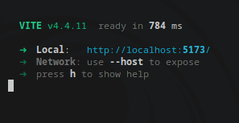

<a name="readme-top"></a>

# 📗 Table of Contents

- [✨ About the Project](#about-project)
  - [🛠 Built With](#built-with)
    - [Tech Stack](#tech-stack)
    - [Key Features](#key-features)
  - [🚀 Live Demo](#live-demo)
- [Resources](#resources)
- [💻 Getting Started](#getting-started)
  - [Prerequisites](#prerequisites)
  - [Local Setup](#local-setup)
  - [Run tests](#run-tests)
- [🤝 Contributing](#contributing)
- [⭐️ Show your support](#support)
- [🙏 Acknowledgements](#acknowledgements)
- [❓ FAQ (OPTIONAL)](#faq)
- [📝 License](#license)

<!-- PROJECT DESCRIPTION -->

# ✨ About Check <a name="about-project"></a>

**Check** is designed to simplify payment management, strengthen client bonds and provide real-time insights.

## 🛠 Built With <a name="built-with"></a>

### Tech Stack <a name="tech-stack"></a>

<ul>
    <li><a href="https://reactjs.org/">MongoDB</a></li>
    <li><a href="https://tailwindcss.com/">React Js</a></li>
    <li><a href="https://www.framer.com/motion/">Framer Motion</a></li>
    <li> Squad api</li>
</ul>

<!-- Features -->

### Key Features <a name="key-features"></a>

- **Advances Invoice Mangement:** Ability to create multiple invoices for clients
- **AI Integration:**
- **Client Profile Management:** Ability to manage client profiles and socials
-- **Insight Reports:**Get Insight reports on total sales sold
<p align="right">(<a href="#readme-top">back to top</a>)</p>

<!-- LIVE DEMO -->

## 🚀 Live Demo <a name="live-demo"></a>

> Add a link to your deployed project.

- [Live Demo Link](https://luxury-torrone-154914.netlify.app/)

<p align="right">(<a href="#readme-top">back to top</a>)</p>

<!-- Resources -->

## Resources <a name="resources"></a>
- https://vitest.dev/guide/
- https://www.behance.net/gallery/97318173/WAVE-Invoicing-and-Money-Management?tracking_source=search_projects&l=29
- https://www.framer.com/motion/introduction/
- https://www.zoho.com/invoice/mobile-apps/
- https://www.invoicesimple.com/

<p align="right">(<a href="#readme-top">back to top</a>)</p>
<!-- GETTING STARTED -->

## 💻 Getting Started <a name="getting-started"></a>

To get a local copy up and running, follow these steps.

### Prerequisites <a name="prerequisites"></a>

In order to run this project you need:

- **Node Js :** To install Node Js on Linux, use the command below:

```sh
sudo apt install Nodejs

```

- **Yarn Package Manager :** After instatallation of NodeJs you install yarn using the command below:

```sh
npm install --global yarn
```

### Local Setup <a name="local-setup"></a>

1. Fork the repo, the clone this repository using the following command (remember to replace the github username in the url)

```sh
  git clone https://github.com/<your-github-username>/check
```

2. Go to the project folder

```sh
cd check
```

3.  Install the dependency required for the project using yarn package manager

```sh
yarn install
```

4. Set up your .env file by duplicating the .env.sample and passing in the necessary parameters

5. To run the project, execute the following command:

```sh
  yarn dev
```

- You should get a result like this
  

### Run tests <a name="run-tests"></a>

To run tests, run the following command:

```sh
  yarn test
```

<!-- CONTRIBUTING -->

## 🤝 Contributing <a name="contributing"></a>

Contributions, issues, and feature requests are welcome!

Feel free to check the [issues page](../../issues/).

<p align="right">(<a href="#readme-top">back to top</a>)</p>

<!-- SUPPORT -->

## ⭐️ Show your support <a name="support"></a>

If you like this project leave a star.

<p align="right">(<a href="#readme-top">back to top</a>)</p>

## ❓ FAQ (OPTIONAL) <a name="faq"></a>

> Add at least 2 questions new developers would ask when they decide to use your project.

<details>
  <summary>What is the Structure of the Application ?</summary>
  <ul>
    The project follows the atomic design principle

  </ul>
</details>

<details>
  <summary>Why is my commit failing ?</summary>
  <ul>
 The application is configured to run the eslint and prettier check on the precommit stage. Read the errors properly and try to fix it
  </ul>
</details>

<p align="right">(<a href="#readme-top">back to top</a>)</p>

<!-- LICENSE -->

## 📝 License <a name="license"></a>

This project is [MIT](./LICENSE) licensed.

_NOTE: we recommend using the [MIT license](https://choosealicense.com/licenses/mit/) - you can set it up quickly by [using templates available on GitHub](https://docs.github.com/en/communities/setting-up-your-project-for-healthy-contributions/adding-a-license-to-a-repository). You can also use [any other license](https://choosealicense.com/licenses/) if you wish._

<p align="right">(<a href="#readme-top">back to top</a>)</p>
